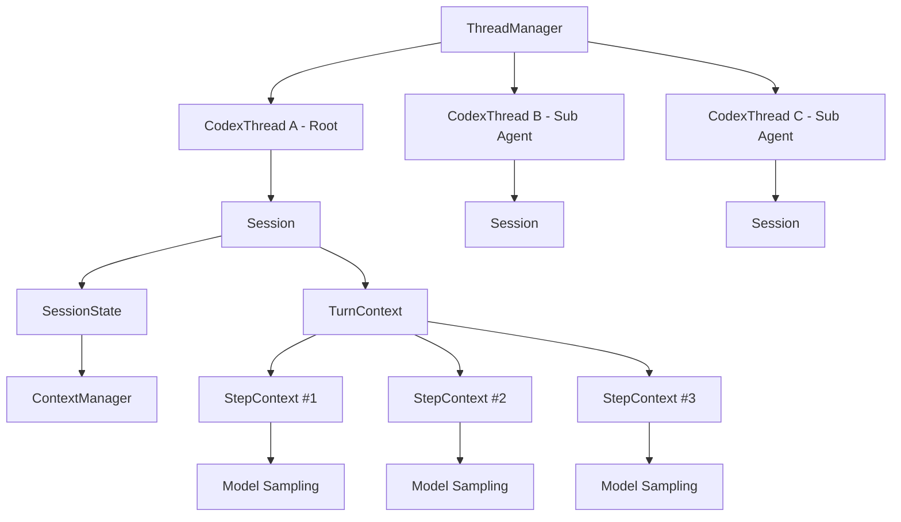
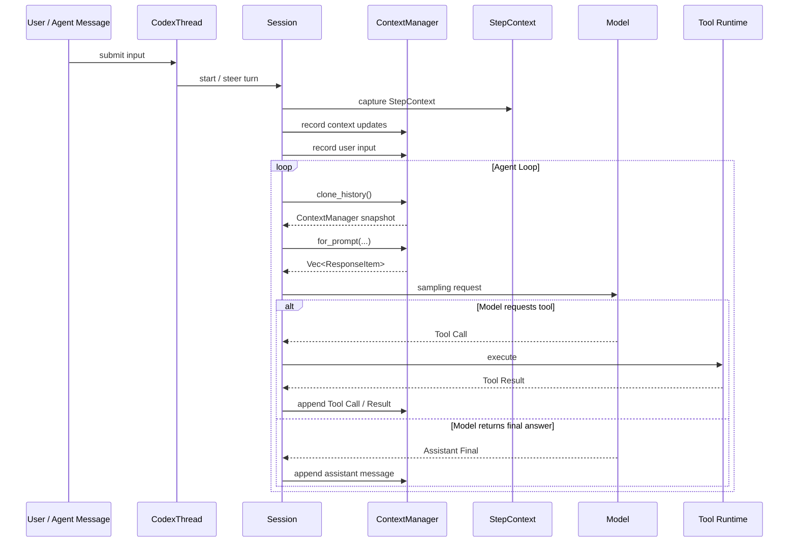
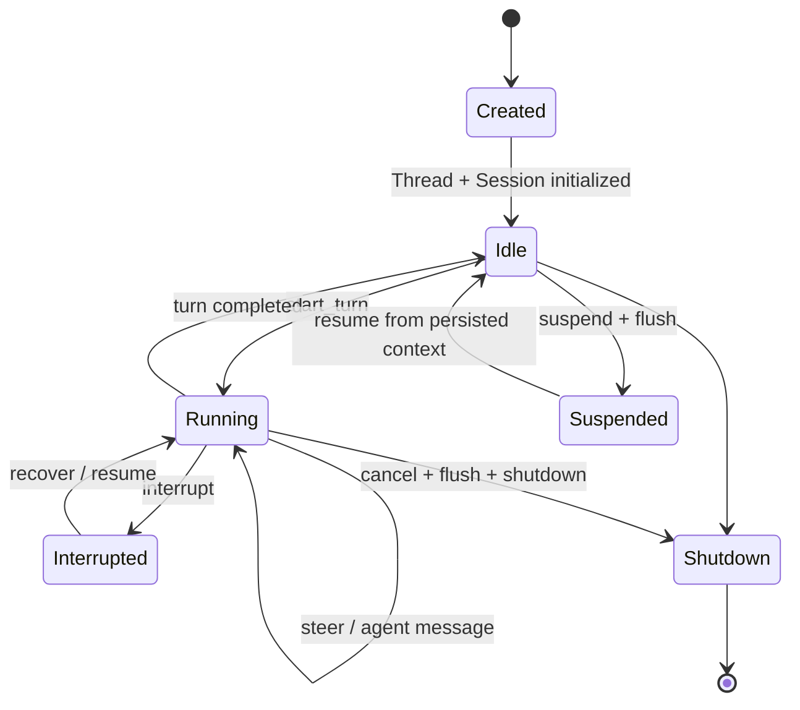
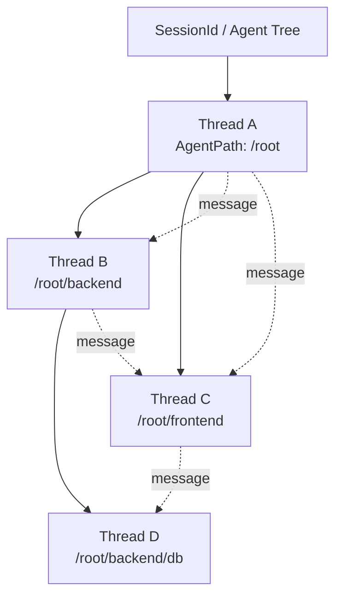
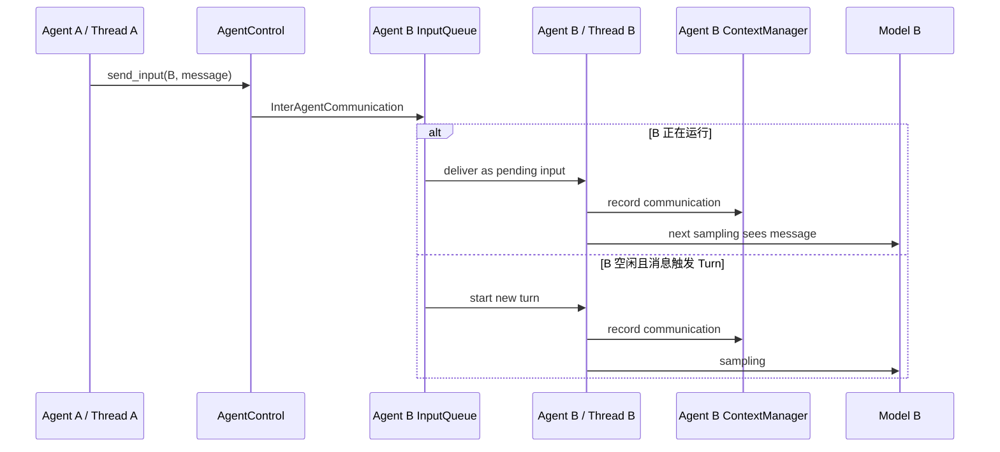
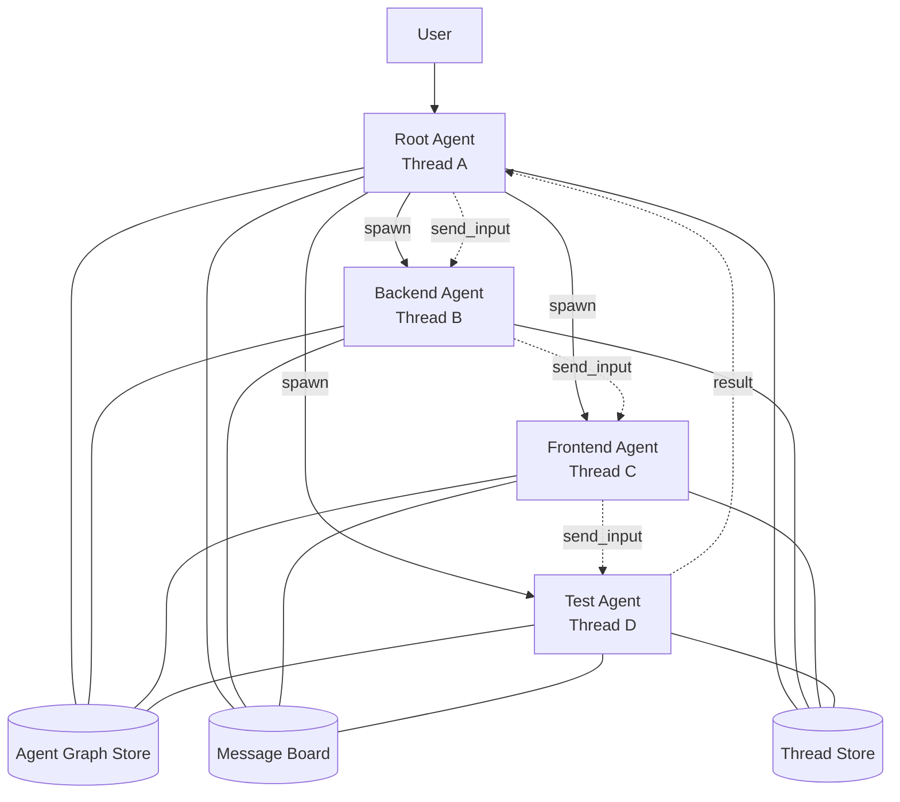
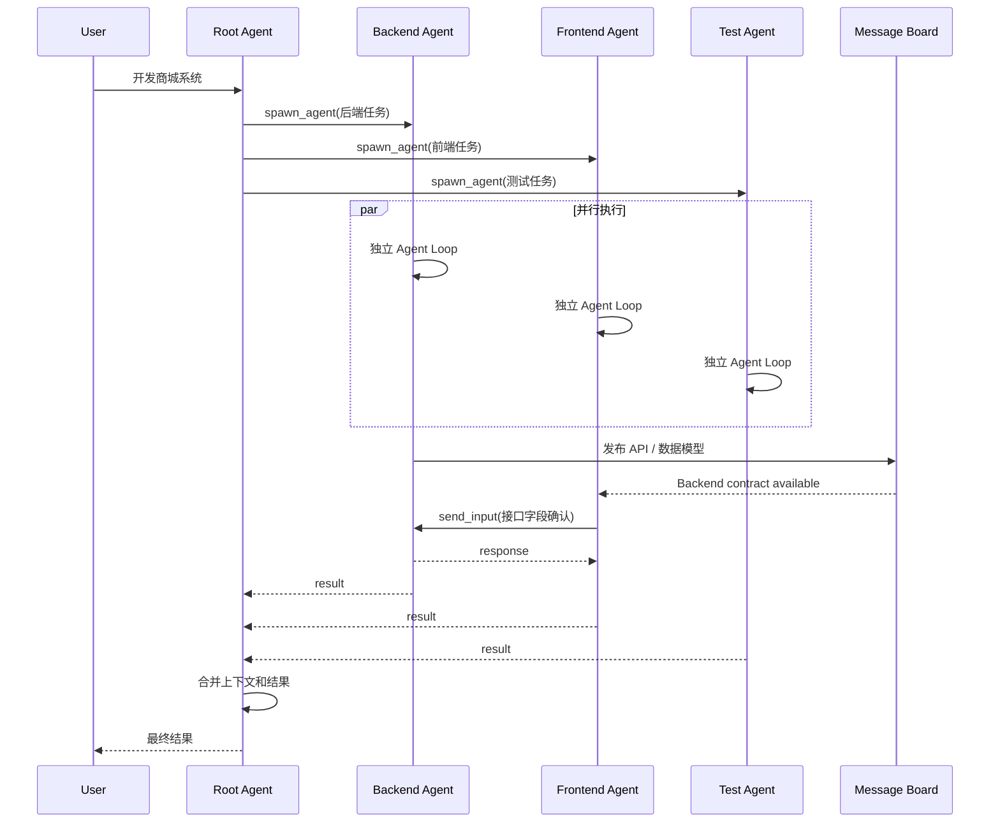

# Codex 如何传递上下文、管理 Session，并实现多 Agent 协作？

> 本文基于 2026-09-27 对 OpenAI `openai/codex` 仓库 `codex-rs` 当前 `main` 分支的源码分析。
>
> 重点不是介绍 UI，而是回答一个架构问题：**如果我要实现多个 Agent / Sub-agent 协作，我应该如何划分上下文、会话生命周期，以及 Agent 之间如何传递信息？**

---

## 1. 先给结论

Codex 当前的设计，不是：

```text
多个 Agent
   ↓
共享同一个 Conversation / Context 对象
```

而更接近：

```text
一个 Agent Tree / SessionId
        │
        ├── Thread A / Root Agent
        │      └── 自己的 Session + ContextManager
        │
        ├── Thread B / Sub-agent
        │      └── 自己的 Session + ContextManager
        │
        └── Thread C / Sub-agent / Sibling Agent
               └── 自己的 Session + ContextManager

Agent 之间通过：
- Fork
- Explicit Input
- InterAgentCommunication
- Message Board
- Agent Graph

进行协作。
```

**每个 Agent 都有独立 Thread 和独立模型上下文。**

真正共享的是：

- 同一棵 Agent Tree 的 `SessionId`；
- 父子拓扑；
- 受控继承的运行环境、权限和 instructions；
- 显式消息；
- 可选的 Message Board；
- 某些 fork 场景下经过清洗后的父 Agent 模型上下文。

这点非常重要。

如果你自己设计多 Agent Runtime，我建议也不要让多个 Agent 直接共享并并发修改同一个 Conversation History。

---

# 2. Codex 中最重要的四层对象

理解 Codex 上下文管理，先区分：

```text
Thread
  ↓
Session
  ↓
Turn
  ↓
Step
```

这四个概念不是一回事。

## 2.1 Thread：一个 Agent 的逻辑会话

核心代码：

- `codex-rs/core/src/thread_manager.rs`
- `codex-rs/core/src/codex_thread.rs`

源码已经明确把过去的 `conversation` 改称为 `thread`。

`ThreadManager` 的职责是：

> 创建 Thread，并维护当前驻留在内存中的 Thread。

可以把它理解成：

```text
ThreadManager
  │
  ├── ThreadId A → CodexThread
  ├── ThreadId B → CodexThread
  └── ThreadId C → CodexThread
```

每个 `CodexThread` 都持有：

```text
CodexThread
├── Arc<Session>
├── SessionIo
├── SessionSource
├── rollout_path
├── lifecycle state
└── runtime metadata
```

因此：

> **Thread 是 Codex 中一个 Agent 最核心的身份边界。**

一个 Sub-agent 并不是父 Agent 内部的一小段临时 Prompt。

它会拥有自己的：

```text
ThreadId
CodexThread
Session
History
Turn
Tool execution
```

---

## 2.2 Session：Thread 的运行时实例

`CodexThread` 内部持有：

```rust
session: Arc<Session>
```

而 Session 中维护该 Thread 的实时运行状态。

最重要的是：

```text
Session
  ↓
SessionState
  ↓
ContextManager
```

`SessionState` 位于：

```text
codex-rs/core/src/state/session.rs
```

它包含：

```text
SessionState
├── session_configuration
├── history: ContextManager
├── previous_turn_settings
├── last_started_turn_id
├── token usage
├── auto compact state
├── additional context
├── permissions
├── connectors
└── runtime state
```

因此可以把 Session 理解成：

> **一个 Thread 被加载进 Runtime 后的“活体”。**

Thread 可以被持久化、关闭、恢复；Session 是它当前运行期间的状态容器。

---

## 2.3 Turn：一次任务 / 用户轮次

源码：

```text
codex-rs/core/src/session/turn_context.rs
```

一个 `TurnContext` 保存一次 Turn 的上下文：

```text
TurnContext
├── turn id / sub_id
├── trace id
├── Config
├── model/provider
├── session_source
├── parent_thread_id
├── environments
├── current date / timezone
├── developer instructions
├── multi_agent_version
├── network
├── sandbox
├── dynamic tools
└── extension data
```

所以：

```text
Thread
  ├── Turn 1
  ├── Turn 2
  ├── Turn 3
  └── ...
```

一个 Thread 生命周期远长于一个 Turn。

---

## 2.4 Step：一次真正的模型 Sampling Request

这是 Codex 设计里非常值得学习的一层。

源码：

```text
codex-rs/core/src/session/step_context.rs
```

`StepContext` 是：

> **一次模型请求级别的不可变快照。**

它包含：

```text
StepContext
├── TurnContext
├── 当前 model settings
├── token budget
├── environment snapshot
├── selected capability roots
├── MCP binding
├── finalized ToolRouter
├── AGENTS.md snapshot
└── realtime state
```

为什么 Turn 里面还需要 Step？

因为一次 Turn 可能调用模型很多次：

```text
用户问题
   ↓
Model Sampling #1
   ↓
Tool Call
   ↓
Tool Result
   ↓
Model Sampling #2
   ↓
Tool Call
   ↓
Tool Result
   ↓
Model Sampling #3
   ↓
Final Answer
```

每一次 Sampling 时：

- 工具可能变化；
- MCP 连接可能变化；
- 环境状态可能变化；
- 用户可能在中途 steer；
- 新的 Agent 消息可能到达。

所以 Codex 不把一个 Turn 的所有请求都绑定死在同一个 Context Snapshot 上。

---

# 3. 整体对象关系



最值得记住的是：

```text
Thread = Agent 身份
Session = Agent 当前运行实例
Turn = 一次任务
Step = 一次模型请求
ContextManager = Thread 自己的模型历史
```

---

# 4. Codex 的上下文到底存在哪里？

核心是：

```text
ContextManager
```

源码：

```text
codex-rs/core/src/context_manager/history.rs
```

它并不是简单的：

```text
Vec<Message>
```

而是包含多个维度：

```text
ContextManager
├── items
│     └── 模型历史 ResponseItemEnvelope
│
├── retained_context
│     └── 不完全依赖模型窗口的 host-owned facts
│
├── review_history
├── history_version
├── reset_version
├── user_message_revision
├── token_info
│
├── reference_context_item
│     └── 上一次模型可见运行环境的 baseline
│
└── world_state_baseline
```

最核心的是：

```text
items: Arc<Vec<ResponseItemEnvelope>>
```

也就是说一个 Thread 的对话历史，是 Session 自己持有的。

不是多个 Agent 共享一个全局 History。

---

# 5. 每次调用模型时，上下文是怎么传进去的？

这是整个问题最核心的调用链。

源码：

```text
codex-rs/core/src/session/turn.rs
```

在 `run_turn()` 中，Codex 每次准备 Sampling Request 时会执行类似逻辑：

```text
Session
  ↓
clone_history()
  ↓
ContextManager
  ↓
for_prompt(model input modalities)
  ↓
Vec<ResponseItem>
  ↓
run_sampling_request(...)
  ↓
Model
```

也就是说：

> **模型上下文不是一个神秘的 Session Handle。Codex 在每次 Sampling 前，都会从当前 Thread 的 ContextManager 构造真正要发送给模型的 Prompt History。**

调用链可以画成：



因此 Codex 的上下文模型更接近：

```text
Persistent Thread History
        ↓
每次请求前生成 Model-visible Context
        ↓
Model
```

而不是：

```text
Model 自动记住 Session
```

---

# 6. 为什么需要 reference_context_item？

ContextManager 中还有一个重要成员：

```text
reference_context_item
```

它记录上一次模型已经看过的运行时 Context Baseline。

例如：

```text
cwd
workspace roots
model settings
environment
realtime state
其他 TurnContext 信息
```

如果当前环境和 baseline 没变化，可以只发送 diff。

如果 baseline 不存在：

```text
reference_context_item = None
```

下一次 Turn 就会重新完整注入上下文。

这对长期 Session 很重要。

否则每一轮都可能重复发送大量：

```text
系统环境
Workspace 信息
AGENTS.md
工具状态
配置
```

---

# 7. Context 并不会无限增长：Compaction

Codex 的历史是有 Context Window 上限的。

`run_turn()` 会持续检查：

```text
当前 token usage
        ↓
是否接近 context limit
        ↓
是
        ↓
Auto Compact
        ↓
替换旧 model window
        ↓
继续 Agent Loop
```

所以生命周期并不是：

```text
History 永远 append
```

而是：

```text
History
  ↓ append
History
  ↓ append
History
  ↓ token limit
Compaction
  ↓
新的 bounded model context
```

这也是为什么 Codex 把：

```text
完整持久化 Rollout
```

和：

```text
当前 Model-visible Context
```

区分开。

这个思想对你设计 Agent Memory 很重要。

---

# 8. Thread / Session 生命周期

从源码抽象以后，一个 Thread 大致经历：



源码提供了多种明确操作：

```text
start_turn_if_idle
start_or_steer_turn
steer_turn
continue_turn_if_idle
recover_turn_if_idle
suspend_turn_and_shutdown
shutdown_and_wait
```

这说明 Codex 没把 Session 生命周期隐藏在一个简单 `while(true)` 里。

而是明确区分：

```text
Thread Lifecycle
Turn Lifecycle
Model Step Lifecycle
```

---

# 9. Thread 如何持久化和恢复？

Codex 有独立的：

```text
ThreadStore
```

其中一个很关键的数据结构是：

```text
StoredModelContext
```

它表示：

> 恢复一个 Thread 当前模型上下文所需要的 Rollout Items。

注意它不一定是全部历史。

Thread Store 可以返回：

```text
完整历史
```

也可以返回：

```text
足以恢复当前模型状态的 suffix / checkpoint
```

恢复时：

```text
ThreadStore
   ↓
StoredModelContext
   ↓
InitialHistory::Resumed
   ↓
重新构造 Session / ContextManager
   ↓
Thread 回到 Runtime
```

所以比较准确的结构是：

```text
          ┌──────────────┐
          │ ThreadStore  │
          └──────┬───────┘
                 │ rollout / model context
                 ▼
ThreadManager → CodexThread → Session → ContextManager
```

这对云端 Agent 非常重要。

Agent 不应该只能依赖内存中的 Conversation 对象。

---

# 10. 进入多 Agent：Root Agent 和 Sub-agent 是什么关系？

Codex 不是把 Sub-agent 当一个函数调用完就销毁。

它会真正创建：

```text
新的 Thread
```

Thread Store 的 `CreateThreadParams` 中明确有：

```text
session_id
thread_id
forked_from_id
parent_thread_id
source
multi_agent_version
history_mode
```

其中注释明确说明：

```text
session_id
= root thread 和它的所有 subagents 共享的 SessionId
```

因此可以画成：



这里：

```text
SessionId
```

更像：

```text
Agent Team / Agent Tree ID
```

而：

```text
ThreadId
```

才是具体 Agent Runtime 身份。

---

# 11. Codex 还单独维护 Agent Graph

源码：

```text
codex-rs/agent-graph-store
```

`AgentGraphStore` 专门保存：

```text
parent_thread_id
        ↓
child_thread_id
```

它支持：

```text
upsert_thread_spawn_edge
set_thread_spawn_edge_status
list_thread_spawn_children
list_thread_spawn_descendants
```

因此：

> **Conversation History 和 Agent Topology 是两个独立的数据模型。**

这是很好的设计。

不要把：

```text
谁是谁的子 Agent
```

塞进聊天历史里临时推断。

应该单独持久化。

---

# 12. 最关键的问题：父 Agent 到底如何把上下文给 Sub-agent？

答案是：

> **不是只有一种方式。**

Codex 至少区分了两个非常重要的模式：

```text
Fresh Spawn
Fork Spawn
```

---

# 13. 模式一：Fresh Spawn

如果创建 Sub-agent 时不要求 fork context：

```text
Parent Thread
      │
      │ spawn_agent(task)
      ▼
New Child Thread
      │
      └── Initial User Input = task
```

子 Agent 不需要复制父 Agent 整段 History。

它主要继承的是运行时能力，例如：

```text
config
environment
cwd
sandbox / permissions
exec policy
instructions
MCP-related state
role configuration
```

然后父 Agent 显式把任务传给它。

例如：

```text
Parent Agent History

User: 帮我开发商城
Assistant: 我准备拆成前后端
...
```

子 Agent 可能只拿到：

```text
你的角色：backend
任务：设计商品和订单接口，并给出数据库模型。
```

而不是父 Agent 的全部聊天内容。

这非常适合：

```text
独立专业 Agent
并行 Agent
Sibling Agent
明确任务委派
```

---

# 14. 模式二：Fork Spawn

如果 `spawn_agent` 启用 fork context：

```text
Parent ContextManager
        ↓
load_agent_model_context
        ↓
筛选 / 清洗 RolloutItem
        ↓
InitialHistory::Forked
        ↓
Child Thread ContextManager
```

Codex 的 `spawn_agent` 工具里存在：

```text
fork_context
```

启用后，会使用：

```text
SpawnAgentForkMode::FullHistory
```

另外底层还支持类似：

```text
Last N Turns
```

这样的 fork 策略。

---

# 15. Fork 不是 memcpy：Codex 会主动过滤父上下文

这是我认为 Codex 多 Agent 设计里最值得参考的一点。

源码：

```text
codex-rs/core/src/agent/control/spawn.rs
```

里面专门有逻辑决定：

```text
父 Thread 的哪些 RolloutItem 可以进入 Child Thread？
```

大体策略如下。

### 会保留的内容

典型包括：

```text
system message
developer message
user message
assistant final answer
部分 configuration
compaction checkpoint
session metadata
```

### 默认不会原样继承的内容

典型包括：

```text
Reasoning
Local Shell Call
Function Call
多数 Tool Call / Tool Result
Web Search Call
Image Generation Call
旧的 Agent Message
父 Agent 的累计 TokenUsage
父 Agent 的安全授权证据
部分实时状态
```

并且还会进一步清洗 developer instructions：

```text
父 Agent role hint
multi-agent hint
current-time reminder
父 Agent 本地 review / approval 信息
```

防止这些东西错误地变成子 Agent 的授权或角色上下文。

所以 Fork 更准确地说是：

```text
Parent Model Context
        ↓
Context Projection / Sanitization
        ↓
Child Model Context
```

而不是：

```text
Child.history = parent.history.clone()
```

---

# 16. Fresh Spawn 和 Fork Spawn 的区别

| 维度 | Fresh Spawn | Fork Spawn |
|---|---|---|
| Child Thread | 新 Thread | 新 Thread |
| 独立 ContextManager | 是 | 是 |
| 父对话历史 | 默认不复制 | 复制经过清洗的模型上下文 |
| 父运行环境 | 可继承 | 可继承 |
| 权限 / Sandbox | 受控继承 | 受控继承 |
| 初始任务 | 显式传入 | 显式传入 + fork context |
| Token 成本 | 较低 | 较高 |
| Context 污染风险 | 较低 | 较高，因此需要过滤 |
| 适合场景 | 并行专家 Agent | 需要理解父 Agent 当前思路的子任务 |

对于你自己的系统，我会把它直接设计成 API：

```text
spawnAgent(
    task,
    contextMode = FRESH | FORK,
    forkPolicy = FULL | LAST_N_TURNS
)
```

---

# 17. Agent 之间不是共享 Context，而是发送 Message

Codex 有明确的数据结构：

```text
InterAgentCommunication
```

而不是：

```text
otherAgent.context.append(...)
```

这是非常重要的边界。

消息发送后，会进入目标 Agent 自己的：

```text
InputQueue
```

然后再变成目标 Agent 的：

```text
TurnInput::InterAgentCommunication
```

最终进入目标 Agent 自己的 History。

因此消息流是：



---

# 18. QueueOnly 和 TriggerTurn

Codex 进一步区分了消息的语义。

在 `delivery.rs` 中：

```text
MessageDeliveryMode::QueueOnly
MessageDeliveryMode::TriggerTurn
```

### QueueOnly

```text
消息到达
  ↓
先进入 mailbox
  ↓
不一定立刻唤醒模型
```

适合：

```text
通知
状态同步
非紧急结果
共享信息
```

### TriggerTurn

```text
消息到达
  ↓
NewTask
  ↓
触发目标 Agent Turn
```

适合：

```text
新的任务
必须处理的 follow-up
明确委派
```

这比所有 Agent 消息都立即唤醒模型要合理很多。

---

# 19. Codex 已经暴露出一套 Multi-Agent Tool Surface

目前源码中的 collaboration tools 包括：

```text
spawn_agent
send_input
wait_agent
resume_agent
close_agent
```

其中：

### spawn_agent

负责创建新的 Agent Thread。

并可以选择：

```text
fork_context = true / false
```

### send_input

给已有 Agent 发送新输入。

支持：

```text
interrupt = true / false
```

也就是说父 Agent 可以：

```text
让子 Agent继续当前任务
```

也可以：

```text
打断并重定向子 Agent
```

### wait_agent

父 Agent 不需要轮询聊天历史。

它订阅目标 Agent 的状态，等待目标达到 final status。

这说明协作控制面和聊天 Context 又是分离的。

---

# 20. 同级 Agent 怎么协作？

你特别提到：

> Agent 可以是 Sub-agent，也可以是同级 Agent。

Codex 的设计也已经出现了这种方向。

关键概念是：

```text
AgentPath
```

源码中：

```text
/root
/root/backend
/root/frontend
/root/backend/db
```

`AgentPath` 是一个稳定的逻辑路由身份。

而：

```text
ThreadId
```

是实际运行实例身份。

因此可以存在：

```text
/root/backend
       │
       └── ThreadId = abc...

/root/frontend
       │
       └── ThreadId = def...
```

Sibling 之间可以通过 AgentControl / AgentPath 解析目标并通信。

这比让 Agent 保存另一个 Agent 的临时内存地址更加稳健。

---

# 21. Message Board：更适合真正的多 Agent 协作

Codex 还有：

```text
AgentMessageBoard
```

对应源码：

```text
codex-rs/core/src/agent_message_board.rs
codex-rs/ext/agent-message-board
```

这个机制非常值得关注。

因为点对点：

```text
send_input(A → B)
```

适合直接协作。

但是如果多个 Agent 都需要共享：

```text
当前任务进度
重要发现
架构决策
Todo
公共事实
```

一直互相发点对点消息会变得很乱。

Message Board 更像：

```text
                ┌───────────────┐
                │ Message Board │
                └───────┬───────┘
                        │
         ┌──────────────┼──────────────┐
         │              │              │
      Agent A         Agent B        Agent C
```

Codex 的实现还明确区分：

```text
Board Storage
```

和：

```text
Live Notification
```

如果目标 Agent 当前不 active，通知可以跳过，但 Board 中的数据仍可以作为共享协调介质存在。

这非常像真正的 Multi-Agent Workspace。

---

# 22. Codex 的多 Agent 架构可以抽象成什么？



这套架构的核心不是“共享 Prompt”。

而是：

```text
Independent Agent State
+
Explicit Communication
+
Shared Coordination Infrastructure
```

---

# 23. 一次完整的 Sub-agent 协作流程

假设用户说：

```text
帮我开发一个商城系统。
```

Root Agent：

```text
Thread A
```

然后它拆任务：

```text
Backend Agent
Frontend Agent
Test Agent
```

流程可以是：



每个 Agent 的 History 都是独立的。

Root Agent 最终得到的是各 Agent 的：

```text
Result / Message
```

而不是直接读取它们所有隐藏的推理过程。

---

# 24. 为什么不应该让所有 Agent 共享同一个 ContextManager？

假设：

```text
Agent A
Agent B
Agent C
```

都直接写：

```text
sharedHistory
```

很快会遇到：

### 1. Token 爆炸

每个 Agent 都会看到：

```text
其他 Agent 的所有 Tool Call
所有日志
所有推理轨迹
所有错误
```

### 2. Context 污染

Backend Agent 不需要看到 Frontend Agent 每一次：

```text
npm install
CSS 修改
浏览器调试
```

### 3. 并发顺序无法定义

```text
Agent A append
Agent B append
Agent C append
```

哪个先？

模型下一次看到的顺序是什么？

### 4. 权限边界混乱

父 Agent 用户明确批准的操作，不应该自动变成子 Agent 的授权。

Codex fork 时主动清理 authorization/review 信息，就是在避免这个问题。

### 5. Agent 角色会互相污染

```text
Backend developer instructions
Frontend developer instructions
Reviewer instructions
```

如果都塞进一个 Prompt，很容易互相冲突。

因此 Codex 选择：

```text
Context Isolation
+
Explicit Context Transfer
```

是非常合理的。

---

# 25. 如果你自己实现，我建议直接借鉴这套模型

如果你准备自己做 Agent Runtime，我建议数据模型直接这样设计。

## AgentSession / AgentTree

```text
AgentSession
├── sessionId
├── rootThreadId
├── createdAt
└── status
```

代表：

```text
一次用户级复杂任务 / 一棵 Agent Tree
```

---

## AgentThread

```text
AgentThread
├── threadId
├── sessionId
├── parentThreadId
├── forkedFromThreadId
├── agentPath
├── agentRole
├── status
├── contextVersion
└── runtimeConfig
```

每个 Agent 一个 Thread。

---

## AgentContext

```text
AgentContext
├── threadId
├── modelHistory
├── retainedContext
├── referenceContext
├── tokenUsage
└── compactCheckpoint
```

一定要：

```text
thread scoped
```

不要：

```text
session scoped shared mutable context
```

---

## AgentGraph

```text
AgentGraphEdge
├── parentThreadId
├── childThreadId
├── depth
└── status
```

独立管理拓扑。

---

## AgentMessage

```text
AgentMessage
├── messageId
├── sessionId
├── senderAgentPath
├── receiverAgentPath
├── type
├── content
├── triggerTurn
├── createdAt
└── status
```

显式通信。

---

# 26. 我会怎样设计 Context Transfer API？

可以直接抽象成：

```java
public enum ContextTransferMode {
    NONE,
    TASK_ONLY,
    LAST_N_TURNS,
    FULL_FORK,
    SUMMARY
}
```

创建 Agent：

```java
spawnAgent(
    parentThreadId,
    role,
    task,
    ContextTransferMode mode
)
```

内部：

```text
NONE
→ 只创建 Agent

TASK_ONLY
→ 新 Agent + task

LAST_N_TURNS
→ 父 Context 最近 N Turn 投影

FULL_FORK
→ 父 Model Context 清洗后 Fork

SUMMARY
→ 父 Agent 先生成 handoff summary，再传给子 Agent
```

实际上，对大部分业务 Multi-Agent，我认为：

```text
TASK_ONLY + SUMMARY
```

应该比：

```text
FULL_FORK
```

更常用。

因为这样 Token 更便宜，角色边界更清晰。

---

# 27. 推荐你的多 Agent Runtime 分层

结合 Codex 的实现，你可以考虑：

```text
┌──────────────────────────────────────┐
│             Agent Platform           │
│ User / Tenant / API / Scheduling     │
└──────────────────┬───────────────────┘
                   │
┌──────────────────▼───────────────────┐
│              Agent Runtime           │
│                                      │
│  ThreadManager                       │
│  AgentGraphManager                   │
│  AgentMessageBus / MessageBoard      │
│  ThreadStore                         │
│  Runtime Scheduler                   │
└──────────────────┬───────────────────┘
                   │
        ┌──────────┼──────────┐
        │          │          │
┌───────▼─────┐ ┌──▼────────┐ ┌▼──────────┐
│ Agent A     │ │ Agent B   │ │ Agent C   │
│ Thread A    │ │ Thread B  │ │ Thread C  │
│ Context A   │ │ Context B │ │ Context C │
└───────┬─────┘ └──┬────────┘ └┬──────────┘
        │           │           │
        └───────────┼───────────┘
                    │
             Explicit Message
```

---

# 28. 如果你是 Java 开发者，可以怎么实现？

你完全不需要照着 Codex 用 Rust。

Control Plane / Agent orchestration 用 Java 很合适。

一个可行结构：

```text
Spring Boot
│
├── AgentSessionService
├── AgentThreadService
├── AgentGraphService
├── AgentContextService
├── AgentMessageService
├── AgentScheduler
│
├── Runtime Worker
│    ├── Agent Loop
│    ├── LLM Client
│    ├── Tool Router
│    └── Context Builder
│
├── PostgreSQL
│    ├── session
│    ├── thread
│    ├── graph
│    ├── message
│    └── checkpoint
│
└── Redis / MQ
     ├── agent mailbox
     ├── status event
     └── scheduling
```

如果以后要强化：

```text
Sandbox
PTY
Process Executor
```

再把底层 Execution Worker 用 Rust 做也完全可以。

---

# 29. Codex 源码中最值得你继续读的文件

## Thread / Session 生命周期

```text
codex-rs/core/src/thread_manager.rs
codex-rs/core/src/codex_thread.rs
codex-rs/core/src/state/session.rs
```

## Agent Loop

```text
codex-rs/core/src/session/turn.rs
```

## Turn / Step Context

```text
codex-rs/core/src/session/turn_context.rs
codex-rs/core/src/session/step_context.rs
```

## History / Context

```text
codex-rs/core/src/context_manager/history.rs
codex-rs/core/src/context_manager/updates.rs
codex-rs/core/src/compact.rs
```

## Multi Agent

```text
codex-rs/core/src/agent/control/spawn.rs
codex-rs/core/src/tools/handlers/multi_agents.rs
codex-rs/core/src/tools/handlers/multi_agents/spawn.rs
codex-rs/core/src/tools/handlers/multi_agents/send_input.rs
codex-rs/core/src/tools/handlers/multi_agents/wait.rs
```

## Agent Communication

```text
codex-rs/core/src/agent_communication.rs
codex-rs/core/src/agent/control/delivery.rs
codex-rs/core/src/session/input_queue.rs
codex-rs/core/src/agent_message_board.rs
```

## Persistence

```text
codex-rs/thread-store/src/types.rs
codex-rs/agent-graph-store/src/store.rs
```

## Agent Identity

```text
codex-rs/protocol/src/agent_path.rs
codex-rs/core/src/agent/registry.rs
```

---

# 30. 对你的问题最重要的 8 个结论

### 1.

**不要把一个 Agent 等同于一次 LLM 请求。**

Agent 应该有长期存在的 Thread。

### 2.

**不要让多个 Agent 默认共享同一份可变 Conversation History。**

每个 Agent 都应该拥有自己的 ContextManager。

### 3.

**Session、Thread、Turn、Sampling Step 要分层。**

```text
Session Tree
  ↓
Thread
  ↓
Turn
  ↓
Step
```

### 4.

**Agent Context Transfer 应该显式设计。**

至少区分：

```text
Fresh
Fork
Summary
```

### 5.

**Fork 必须做 Context Sanitization。**

不要把：

```text
所有 Tool Call
所有内部 Reasoning
所有安全授权
父 Agent 临时状态
```

无脑复制给 Child。

### 6.

**Agent 协作应该依赖 Message，而不是直接修改对方 Context。**

```text
Agent A
   ↓ Message
Agent B Mailbox
   ↓
Agent B Context
```

### 7.

**Agent Topology 要单独持久化。**

```text
AgentGraph
```

和：

```text
Conversation History
```

是两回事。

### 8.

真正成熟的 Multi-Agent Runtime 最终会变成：

```text
Independent Context
+ Agent Graph
+ Message Bus
+ Shared Board
+ Persistent Thread Store
+ Lifecycle Manager
```

而不仅仅是：

```text
一个 Agent 调另一个 Agent 的 Prompt
```

---

# 31. 一句话总结 Codex 的设计

> **Codex 把每个 Agent 建模成独立 Thread：Thread 自己维护 Session、ContextManager、Turn 和模型请求；父子 Agent 通过 Agent Graph 建立关系，通过 Fresh/Fork 两种策略决定是否继承上下文，通过 InterAgentCommunication 和 Message Board 显式协作，并通过 Thread Store 持久化、恢复和压缩模型上下文。**

如果你要自己实现多 Agent Runtime，这套设计最值得借鉴的不是某一个 Rust 类型，而是：

```text
上下文隔离
显式传递
独立生命周期
拓扑与对话分离
运行态与持久态分离
```

这五个原则。

---

# 源码参考

以下链接均指向 OpenAI Codex 官方仓库：

- [ThreadManager](https://github.com/openai/codex/blob/main/codex-rs/core/src/thread_manager.rs)
- [CodexThread](https://github.com/openai/codex/blob/main/codex-rs/core/src/codex_thread.rs)
- [SessionState](https://github.com/openai/codex/blob/main/codex-rs/core/src/state/session.rs)
- [ContextManager](https://github.com/openai/codex/blob/main/codex-rs/core/src/context_manager/history.rs)
- [Turn Agent Loop](https://github.com/openai/codex/blob/main/codex-rs/core/src/session/turn.rs)
- [TurnContext](https://github.com/openai/codex/blob/main/codex-rs/core/src/session/turn_context.rs)
- [StepContext](https://github.com/openai/codex/blob/main/codex-rs/core/src/session/step_context.rs)
- [Agent Spawn / Fork](https://github.com/openai/codex/blob/main/codex-rs/core/src/agent/control/spawn.rs)
- [Multi-Agent Tool Handler](https://github.com/openai/codex/blob/main/codex-rs/core/src/tools/handlers/multi_agents.rs)
- [spawn_agent Tool](https://github.com/openai/codex/blob/main/codex-rs/core/src/tools/handlers/multi_agents/spawn.rs)
- [send_input Tool](https://github.com/openai/codex/blob/main/codex-rs/core/src/tools/handlers/multi_agents/send_input.rs)
- [wait_agent Tool](https://github.com/openai/codex/blob/main/codex-rs/core/src/tools/handlers/multi_agents/wait.rs)
- [Inter-Agent Delivery](https://github.com/openai/codex/blob/main/codex-rs/core/src/agent/control/delivery.rs)
- [InputQueue](https://github.com/openai/codex/blob/main/codex-rs/core/src/session/input_queue.rs)
- [Agent Message Board](https://github.com/openai/codex/blob/main/codex-rs/core/src/agent_message_board.rs)
- [Thread Store Types](https://github.com/openai/codex/blob/main/codex-rs/thread-store/src/types.rs)
- [Agent Graph Store](https://github.com/openai/codex/blob/main/codex-rs/agent-graph-store/src/store.rs)
- [AgentPath](https://github.com/openai/codex/blob/main/codex-rs/protocol/src/agent_path.rs)
